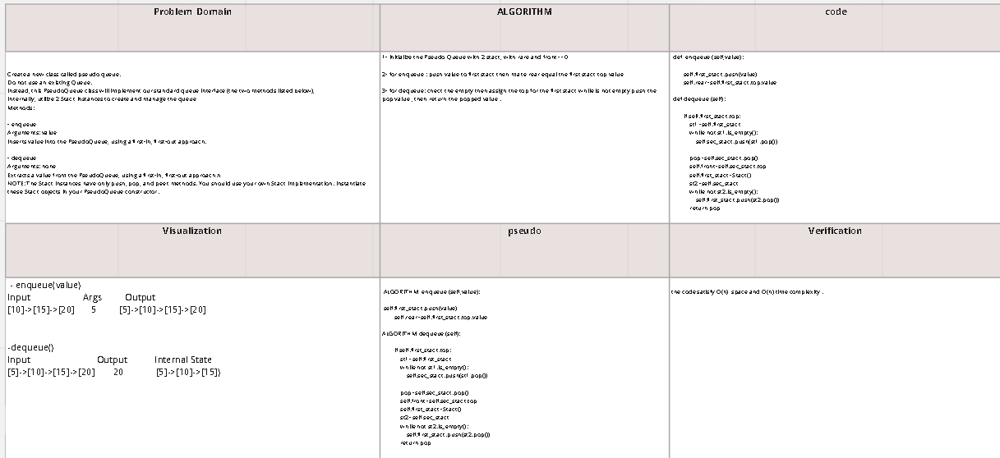
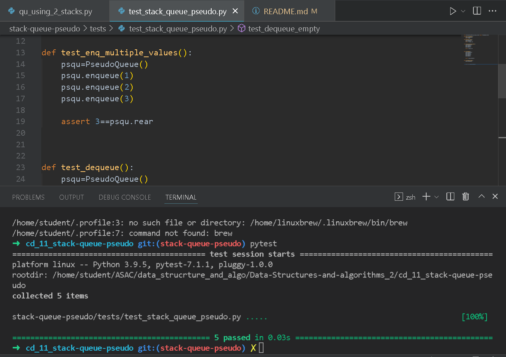

## Code Challenge
Implement a Queue using two Stacks.

## Specifications

Read all of these instructions carefully.
Name things exactly as described.
Do all your work in a your data-structures-and-algorithms public repository.
Create a new branch in your repo named as noted below.
Follow the language-specific instructions for the challenge type listed below.
Update the “Table of Contents” - in the README at the root of the repository - with a link to this challenge’s README file.
Challenge Setup & Execution
Branch Name: stack-queue-pseudo

Challenge Type: Code Challenge / Algorithm

## Feature Tasks
Create a new class called pseudo queue.
Do not use an existing Queue.
Instead, this PseudoQueue class will implement our standard queue interface (the two methods listed below),
Internally, utilize 2 Stack instances to create and manage the queue
Methods:

- enqueue
Arguments: value
Inserts value into the PseudoQueue, using a first-in, first-out approach.

- dequeue
Arguments: none
Extracts a value from the PseudoQueue, using a first-in, first-out approach.h
NOTE: The Stack instances have only push, pop, and peek methods. You should use your own Stack implementation. Instantiate these Stack objects in your PseudoQueue constructor.

Example : 
- enqueue(value)
Input	            Args	      Output
[10]->[15]->[20]	5	       [5]->[10]->[15]->[20]
 	                5	             [5]

- dequeue()
Input	                   Output	         Internal State
[5]->[10]->[15]->[20]	     20	             [5]->[10]->[15])
[5]->[10]->[15]	             15             	[5]->[10]

## Whiteboard Process
<!-- Embedded whiteboard image -->

## Approach & Efficiency
<!-- What approach did you take? Why? What is the Big O space/time for this approach? -->

## Solution
<!-- Show how to run your code, and examples of it in action -->
