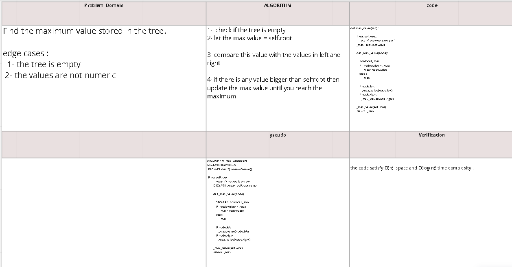

# Code Challenge
Find the Maximum Value in a Binary Tree

Specifications
Read all of these instructions carefully.
Name things exactly as described.
Do all your work in a your data-structures-and-algorithms public repository.
Create a new branch in your repo named as noted below.
Follow the language-specific instructions for the challenge type listed below.
Update the “Table of Contents” - in the README at the root of the repository - with a link to this challenge’s README file.
Challenge Setup & Execution
Branch Name: tree-max

Challenge Type: Extending an Implementation

# Feature Tasks
Write the following method for the Binary Tree class

- find maximum value
Arguments: none
Returns: number
Find the maximum value stored in the tree. You can assume that the values stored in the Binary Tree will be numeric.

## Whiteboard Process
https://miro.com/app/board/uXjVO8PkfNY=/

## Solution
 