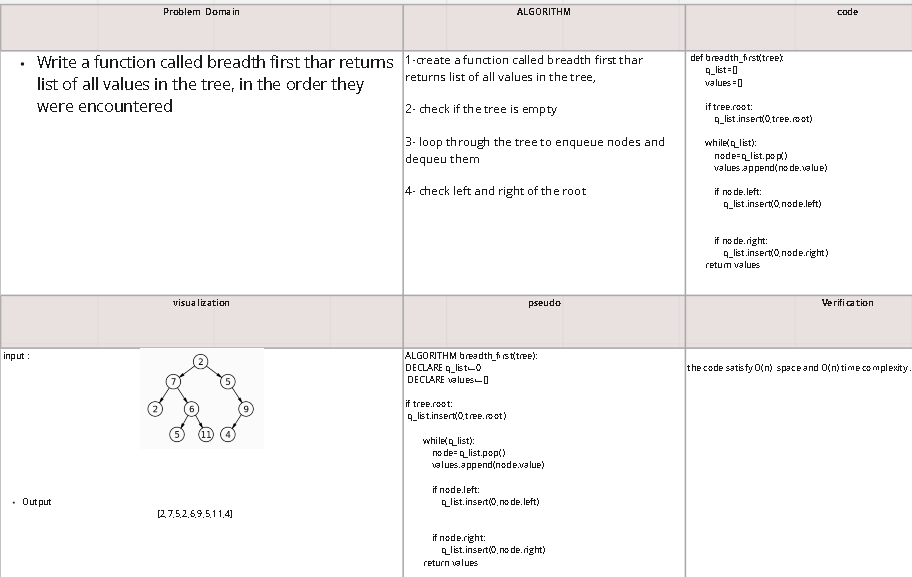
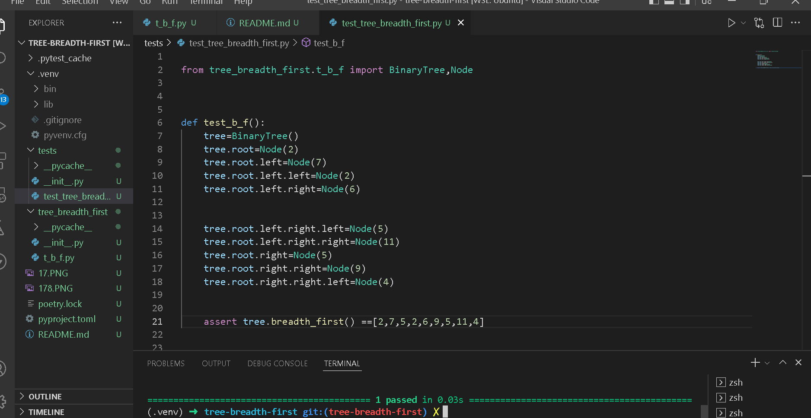

# Challenge Setup & Execution
Branch Name: tree-breadth-first

Challenge Type: Code Challenge / Algorithm

# Feature Tasks
Write a function called breadth first
Arguments: tree
Return: list of all values in the tree, in the order they were encountered
NOTE: Traverse the input tree using a Breadth-first approach

 ## Approach & Efficiency

the code satisfy O(n)  space and O(n) time complexity .
## Whiteboard Process
https://miro.com/app/board/uXjVOtzMRQQ=/?share_link_id=909528503851 
 
 
 

## Solution
 
 
