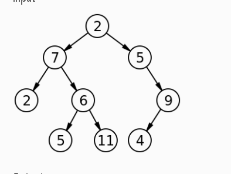
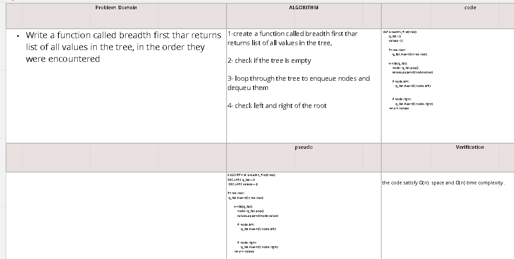

## Challenge Setup & Execution
Branch Name: tree-breadth-first

Challenge Type: Code Challenge / Algorithm

Feature Tasks
Write a function called breadth first
Arguments: tree
Return: list of all values in the tree, in the order they were encountered
NOTE: Traverse the input tree using a Breadth-first approach

Example
Input

Output
[2,7,5,2,6,9,5,11,4]

## Whiteboard Process
https://miro.com/app/board/uXjVO8PkfNY=/

 
 
 

## Solution
 
 
