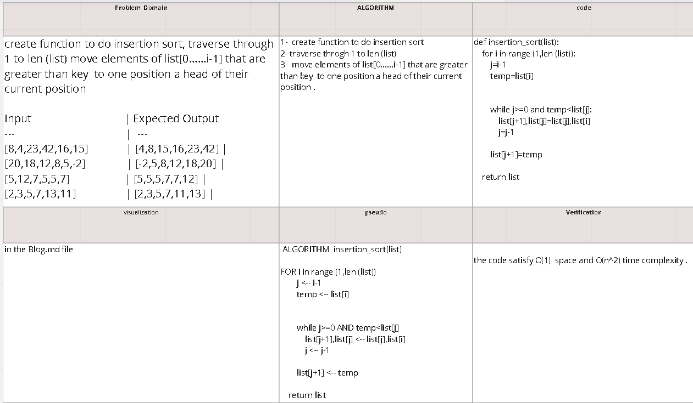
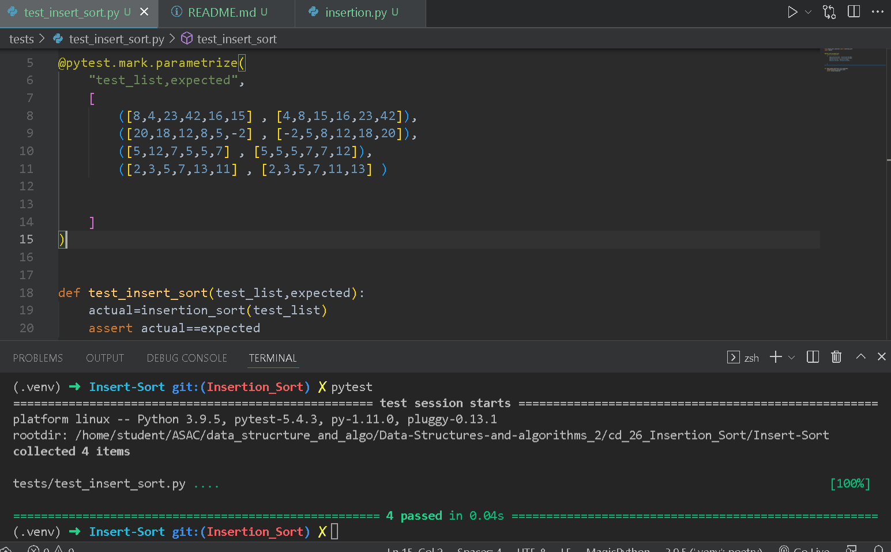

# Challenge Summary

Review the pseudocode for the given problem , then trace the algorithm by stepping through the process with the provided sample array. Document the  explanation by creating a blog article that shows the step-by-step output after each iteration through some sort of visual.

## Whiteboard Process

## Approach & Efficiency

time complexity : O(n^2)
space : O(1)

## Solution

 
 

 

 

 
