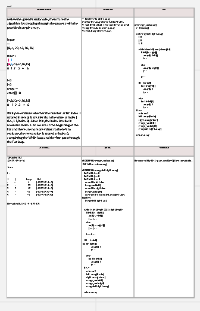
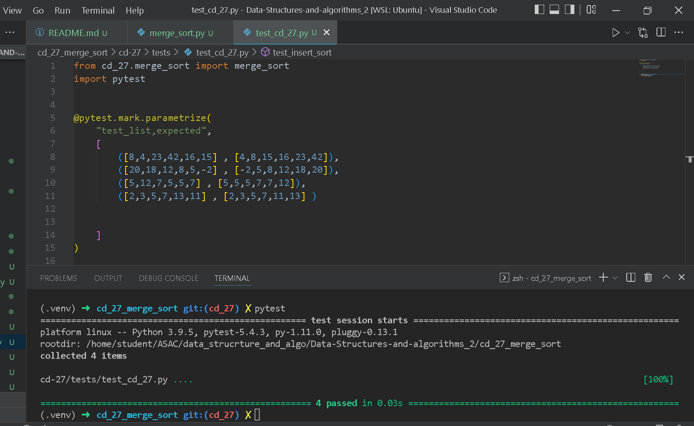

# Challenge Summary

review the given Pseudocode , then trace the algorithm by stepping through the process with the provided sample array .

## Whiteboard Process
<<<<<<< HEAD
the link for the whiteboard : https://miro.com/app/board/uXjVO0UoyNI=/?share_link_id=153014147355

=======
the link for thw whiteboard : https://miro.com/app/board/uXjVO0UoyNI=/ 
>>>>>>> 44d3d0b8f4ea2fe9d24a4cdd51e786a6ab18eefd

## Approach & Efficiency

time complexity : O(n^2)
space : O(1)

## Solution

 