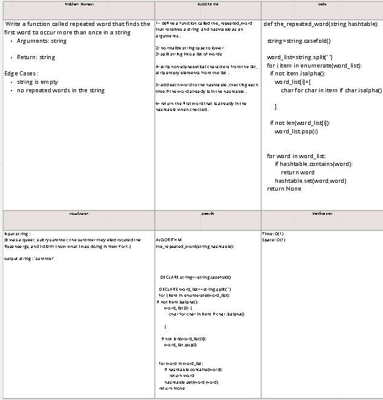

# Challenge Summary
<!-- Description of the challenge -->

Write a function called repeated word that finds the first word to occur more than once in a string.
 

## Whiteboard Process
<!-- Embedded whiteboard image -->
https://miro.com/app/board/uXjVOtxCYh8=/?share_link_id=45328237459 

## Approach & Efficiency
<!-- What approach did you take? Why? What is the Big O space/time for this approach? -->
time : O(1)
space : O(1)

 
