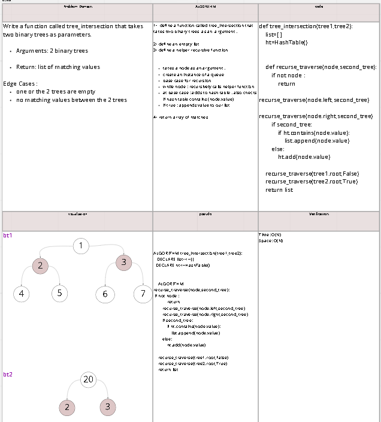
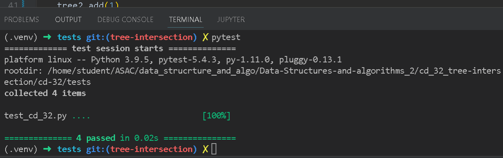

# Challenge Summary
<!-- Description of the challenge -->
Write a function called tree_intersection that takes two binary trees as parameters.and returns a list of the elements that both trees have in common.

## Whiteboard Process
<!-- Embedded whiteboard image --->

the link for whiteboard :
 https://miro.com/app/board/uXjVOt2gQyA=/ 

## Approach & Efficiency
time = O(N)
space=O(N)

## Solution

