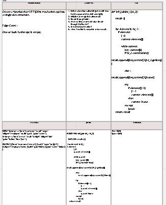

# Challenge Summary
<!-- Description of the challenge -->
 write a function that takes two hash tables as arguements and returns a list of the joined key/values. If there is no match in the second hash table for a given key, the list will include None for as the value joined from the 2nd hash table.

## Whiteboard Process
<!-- Embedded whiteboard image -->
https://miro.com/app/board/uXjVOtxJMYI=/ 

## Approach & Efficiency
<!-- What approach did you take? Why? What is the Big O space/time for this approach? -->
Time: O(N)
Space: O(N)