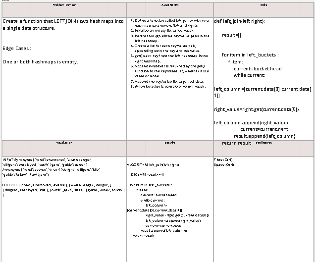

# Challenge Summary
<!-- Description of the challenge -->
Create a function that LEFT JOINs two hashmaps into a single data structure.

## Whiteboard Process
<!-- Embedded whiteboard image -->

## Approach & Efficiency
<!-- What approach did you take? Why? What is the Big O space/time for this approach? -->
Time: O(N)
Space: O(N)