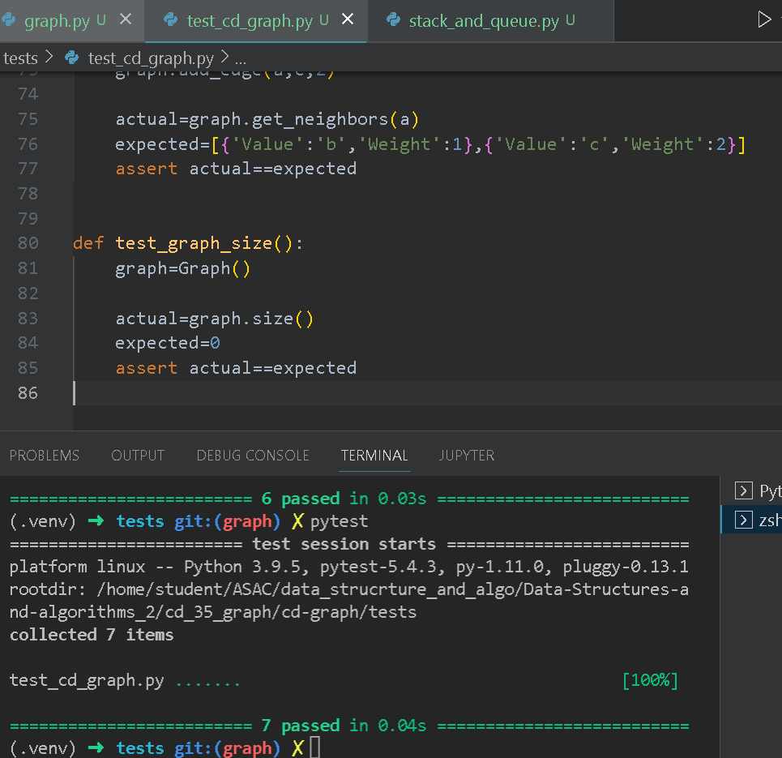

# Challenge Summary
<!-- Description of the challenge -->
Create Graph, Vertex, and Edge classes which together allow for the construction and representation of various graphs.

 Input	           Expected Output
A, B, C, D      	A ----(2)---> C
A -> B (1)	
A -> C (2)	
B -> D (3)        	/ /
C -> D (4)       	B ----(3)---> D

## Approach & Efficiency
<!-- What approach did you take? Why? What is the Big O space/time for this approach? -->
Time: O(N)
Space: O(N)

## Solution
<!-- Show how to run your code, and examples of it in action -->

